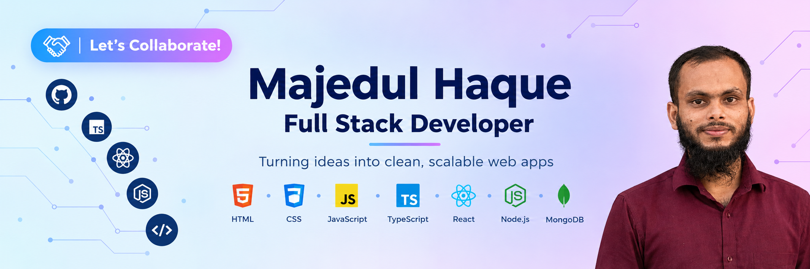

  

 

# Hi there, I'm Majedul Haque 👋
### Full Stack Web Developer

I build responsive, user-friendly web applications from frontend to backend.

📍 **Location:** Mirpur, Dhaka, Bangladesh  
📧 **Email:** [majedulhaque45@gmail.com](majedulhaque45@gmail.com)

---

## 👨‍💻 About Me

I'm **Majedul Haque**, a Full Stack Web Developer who enjoys turning ideas into useful, polished digital experiences. I like building clean interfaces, developing backend functionality, and connecting applications to databases. I’m always learning and improving by building projects and exploring new tools.

### 🔭 What I'm up to

- 💻 Building and improving full-stack web applications.
- 🌱 Sharpening my React, Node.js, and TypeScript skills.
- 🧪 Practising through hands-on projects and exploring better development workflows.
- 🤝 Open to collaborating on interesting web projects.

<!-- Add real, current activities here, for example:
- 🚧 Currently building [Project Name](REPOSITORY_URL) — short project description.
- 📚 Currently exploring Next.js, Docker, or another technology you are learning.
-->

---

## 🧰 Skills & Technologies

### Frontend

  

### Backend & Database

  

### Tools & Platforms

  

---

## 🌐 Connect With Me

  
  
  
  

---

## 🧩 What I Focus On

<table>
  <tr>
    <td align="center" width="33%">
      <h3>🎨 Frontend</h3>
      Responsive layouts Reusable UI User experience
    </td>
    <td align="center" width="33%">
      <h3>⚙️ Backend</h3>
      Server-side logic API development Application structure
    </td>
    <td align="center" width="33%">
      <h3>🗄️ Data</h3>
      MongoDB Data-driven features Reliable data flow
    </td>
  </tr>
</table>

---

## 📌 Featured Projects

<!-- Replace the sample names, links, descriptions, and stacks with your actual projects.
     Pin at least two repositories via GitHub Profile → Customize your pins. -->

<table>
  <tr>
    <td width="50%">
      <h3><a href="https://github.com/majedul45/DevStack-React-A05">🚀 Project One</a></h3>
      
My Assignment-5 Project

      
<strong>Tech:</strong> tailwind css, react, nextJS

      <a href="https://neon-puffpuff-874999.netlify.app/">Live Demo</a> · <a href="https://github.com/majedul45/DevStack-React-A05">Source Code</a>
    </td>
    <td width="50%">
      <h3><a href="https://github.com/majedul45/fitlog-app-a06">✨ Project Two</a></h3>
      
My Assignment-6 Project

      
<strong>Tech:</strong> react, nextJS

      <a href="https://fitlog-app-a06.vercel.app">Live Demo</a> · <a href="https://github.com/majedul45/fitlog-app-a06">Source Code</a>
    </td>
  </tr>
</table>

---

## 📊 GitHub Stats

<!-- 
 -->

  

  

---

## 💬 A Developer's Note

> Great software is built one thoughtful improvement at a time.  
> Keep learning, keep building, and stay curious.

---
  

### 💡 Build • Learn • Share • Repeat

*Thanks for visiting my profile! Feel free to explore my repositories and connect with me.*

